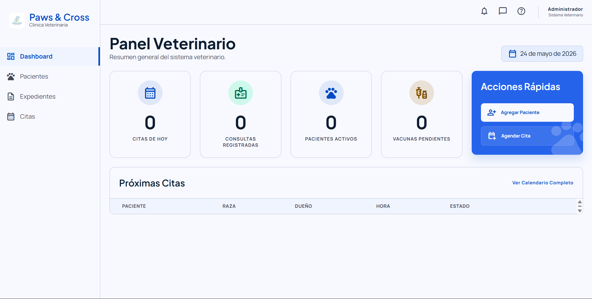
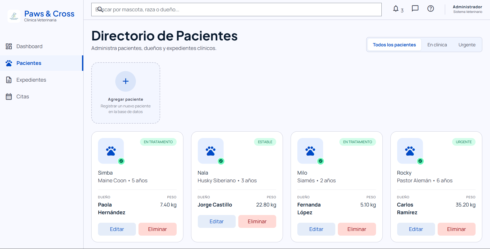
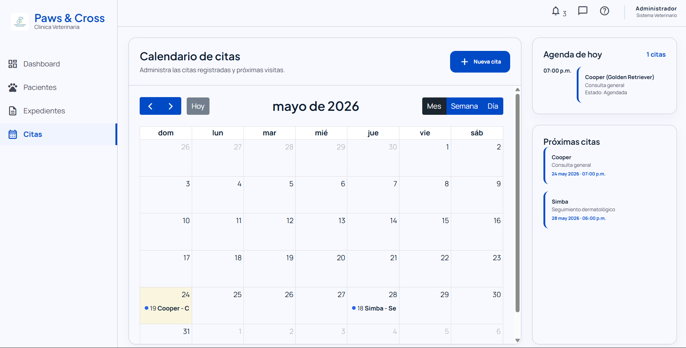

# 🐾 Sistema de Gestión Veterinaria

## Descripción General

Sistema web de gestión veterinaria desarrollado como proyecto académico utilizando tecnologías Full Stack modernas.

La aplicación permite administrar pacientes, citas, consultas y expedientes clínicos mediante una interfaz intuitiva y dinámica orientada a clínicas veterinarias.

El sistema está enfocado en facilitar el control y seguimiento de mascotas, automatizando procesos administrativos y mejorando la organización de la información médica.


# Descripción Técnica

El proyecto fue desarrollado utilizando una arquitectura cliente-servidor basada en JavaScript.

## Tecnologías utilizadas

### Frontend

* HTML5
* CSS3
* JavaScript
* FullCalendar

### Backend

* Node.js
* Express.js

### Base de datos

* PostgreSQL

### Herramientas de desarrollo

* Visual Studio Code
* Thunder Client
* Git
* GitHub
* Docker Desktop


# ⚙️ Funcionalidades principales

## Gestión de pacientes

* Registro de mascotas
* Edición de información
* Eliminación de registros
* Visualización de expedientes

## Gestión de citas

* Registro de citas veterinarias
* Calendario dinámico con FullCalendar
* Visualización de próximas citas
* Notificaciones de citas pendientes

## Consultas médicas

* Registro de consultas
* Historial clínico
* Observaciones veterinarias
* Seguimiento de tratamientos

## Vacunación

* Registro de vacunas aplicadas
* Seguimiento de vacunas pendientes

## Dashboard administrativo

* Panel principal dinámico
* Tarjetas de información
* Estadísticas básicas
* Acceso rápido a módulos

## Interfaz moderna

* Diseño responsive
* Modales dinámicos
* Navegación intuitiva


# Descripción orientada al usuario

El sistema permite que una clínica veterinaria pueda administrar de manera sencilla la información de sus pacientes.

Los usuarios pueden:

* Registrar mascotas
* Consultar expedientes
* Agendar citas
* Llevar seguimiento médico
* Gestionar vacunas
* Visualizar información desde un panel centralizado

Todo esto mediante una interfaz visual moderna y fácil de utilizar.


# Estructura del proyecto

```bash
project/
│
├── backend/
│   ├── controllers/
│   ├── routes/
│   ├── models/
│   ├── database/
│   └── server.js
│
├── frontend/
│   ├── css/
│   ├── js/
│   ├── pages/
│   └── assets/
│
├── package.json
└── README.md
```


# Instalación y ejecución

## 1️⃣ Clonar repositorio

```bash
git clone https://github.com/usuario/repositorio.git
```


## 2️⃣ Instalar dependencias

```bash
npm install
```


## 3️⃣ Configurar PostgreSQL

Crear la base de datos y configurar las credenciales correspondientes.


## 4️⃣ Ejecutar servidor

```bash
node server.js
```

O utilizando nodemon:

```bash
npm run dev
```


# Objetivo del proyecto

El objetivo principal del proyecto es aplicar conocimientos de desarrollo Full Stack mediante la construcción de un sistema funcional orientado a un caso real.

Durante el desarrollo se implementaron conceptos como:

* CRUD
* Consumo de APIs
* Arquitectura cliente-servidor
* Manejo de bases de datos
* Manipulación del DOM
* Modularización de código
* Diseño responsive
* Gestión de rutas


# Aprendizajes obtenidos

Durante el desarrollo del proyecto se fortalecieron habilidades relacionadas con:

* Desarrollo web Full Stack
* Organización de proyectos
* Integración frontend-backend
* Manejo de PostgreSQL
* Uso de Git y GitHub
* Diseño de interfaces dinámicas
* Resolución de errores y debugging


# Capturas del sistema

## Dashboard



## Gestión de pacientes



## Calendario de citas




# 📄 Licencia

Proyecto desarrollado con fines académicos y educativos.


# Autor

Desarrollado por Oscar López.